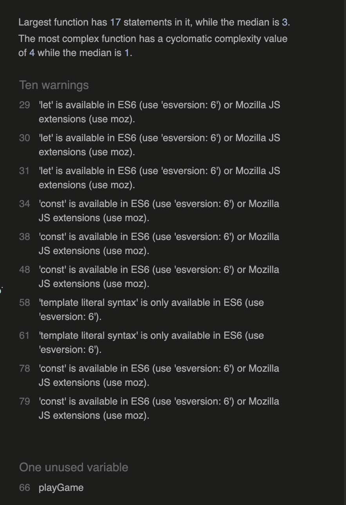

# Rock, Paper, Scissors, Lizard, Spock

# Overview

Rock, Paper, Scissors, Lizard, Spock is an extended version of the classic Rock, Paper, Scissors game. 
It was popularized by the TV show The Big Bang Theory, originally invented by Sam Kass and Karen Bryla to reduce the chances of a tie in the traditional game.

This website is the digital version of that game, using the same logic and fun but on your mobile or computer. 

## Key Project Goals
* Provide an Interactive Experience for users.
* Design a User Interface that is clean and modern.
* Create a game for users that is accesible and easy to use.
* Create a fun and engaging experience for my target audience.

## Target Audience
* Casual gamers and fans of classic games. - Anyone looking for a quick and entertaining game experience.
* Tech enthusiasts and developers. - Those interested in JavaScript based games and interactive UI/UX design.
* Students & Educators. - Useful for demonstrating simple game logic and UI interactions.

## Design and Layout
The Rock, Paper, Scissors, Lizard, Spock game features a clean, engaging, and user-friendly interface that enhances the player's experience. The layout is structured for clarity and ease of interaction, ensuring that players can quickly understand and enjoy the game.

## Colorful and Interactive UI
* The game uses vibrant, well-contrasted buttons for each choice (Rock, Paper,       Scissors, Lizard, Spock), making it visually appealing and intuitive.
* Each button has a unique color-coded design, improving accessibility and making    selection effortless.

## Score and Game Status Display
* At the top, a clear scoreboard displays the Player Score, Computer Score, and      Tries Left, allowing players to track progress at a glance.
* The central game area prominently displays the player's and computer's choices,   ensuring transparency in gameplay.

## Navigation and User Experience
* A Rules button in the top right provides easy access to game instructions.
* The modern, minimalist aesthetic keeps the focus on the game while maintaining an engaging visual appeal.
* The game employs a responsive layout, ensuring smooth gameplay across different devices and screen sizes.

## Why This Design Works
* Simple yet effective: The layout is easy to navigate while still offering an exciting game experience.
* Engaging color scheme: Different colors for each option make the game fun and visually stimulating.
* Clear game mechanics: The score, tries left, and player choices are always visible, making it easy to follow each round.

### User Stories

The following user stories guided the development of this project:

1. **Player Move Selection**  
As a player, I want to select a move (rock, paper, scissors, lizard, spock) so that I can actively participate in the game.

2. **Random Computer Move**  
As a player, I want the computer to make a random move so that each round is fair and unpredictable.

3. **Score Tracking**  
As a player, I want to see the current score and number of tries left so that I can track my progress and performance.

4. **Round Result Feedback**  
As a player, I want a message showing whether I won, lost, or tied each round so I know the outcome immediately.

5. **Game Restart**  
As a player, I want to restart the game so that I can play again from the beginning without refreshing the page.

6. **Input Validation**  
As a player, I want the game to handle invalid input gracefully so that the game does not break if a choice is missing or invalid.

7. **Clear Interface and Navigation**  
As a player, I want the game interface to be clear and easy to interact with so that I can use it without confusion.

### JavaScript Testing

**Tool Used:** [JSHint](https://jshint.com/)

1. **Initial Test:**
- JSHint reported the following issues:
- One unused variable ('playGame')
- ES6 options not set at the top of the file
- Screenshot of initial JSHint output:

2. **Corrections Made:**
- Added `/* jshint esversion: 6 */` at the very top of the JS file/
- Removed unused self calls and exlicitly called `playGame()`

3. **Final Test:**
- JSHint now reports no errors.
- Screenshot of final JSHint output:

### HTML Validation

**Tool Used:** [W3C HTML Validator](https://validator.w3.org/)

1. **Initial Test:**
- Found issues including:
- Trailing slashes on void elements interacting poorly with unquoted attribute values
- Screenshot of initial HTML validation output:

2. **Corrections Made:**
- Removed trailing slashes from void elements like `<link>` and `<meta>`.
- Ensured all attribute values were properly quoted.

3. **Final Test:**
- HTML now passes validation with no errors, only informational messages.
- Screenshot of final HTML validation:

### 3. CSS Validation

**Tool Used:** [W3C CSS Validator (Jigsaw)](https://jigsaw.w3.org/css-validator/)

1. **Initial Test:**
- One CSS error was detected:
- Invalid padding values

- Screenshot of initial CSS validation output: 

2. **Corrections Made:** 
- Replaced invalid padding values

3. **Final Test:**
- CSS now passes validation with no errors.
- Screenshot of final CSS validation:

### Manual Testing

1. **User Interaction Testing:**
- Clicked all game buttons (Rock, Paper, Scissors, Lizard, Spock) and verified correct responses.
- Tested the scoreboard updating correctly after each round.
- Ensured the “Restart” button resets scores and tries. 

2. **Edge Cases:**
- Checked that the gamr correctly ends when tries reach zero.

3. **Lighthouse Testing:**
- Screenshot of index.html Lighthouse Test:

- Screenshot of rules.html Lighthouse Test:

4. **Conclusion:**  
- After automated validation and manual testing, the application meets functionality and quality standards.  
- All code passes validation, user interaction is clear, and the game behaves as expected.

### Navigation
* I have tested the navigation button to ensure it is linked correctly.

### Responsiveness
* I have tested the website across multiple screens to ensure it responds to multiple screen sizes.

### Deployment
* Go to settings tabs in GitHub repository.
* Go to 'Pages'.
* Set Source to Deploy from Branch.
* Select Main Branch.
* Set Folder to /(root).
* Click Save.

## Attribution

The development of this project was supported by the following resources:

- **W3C Validators** – HTML, CSS, and JavaScript validation tools were used to ensure code quality and standards compliance.  
- **Font Awesome** – icons used in the project (https://fontawesome.com/).  
- **Code Institute Learning Materials** – general reference for project structure, HTML/CSS/JS best practices, and project guidance.  
- **Mozilla Developer Network (MDN)** – documentation for JavaScript, HTML, and CSS used as reference for functions, events, and styling.  
- **Online tutorials and educational videos** – general learning resources on HTML structure, CSS styling, layout, and JavaScript concepts.

Live Link Here: [Rock, Paper, Scissors, Lizard, Spock](https://francisjxmes.github.io/rock-paper-scissors-lizard-spock/)

  
